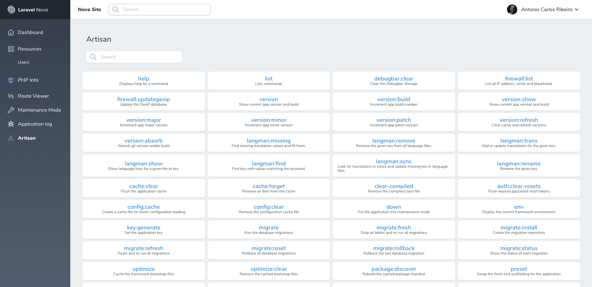
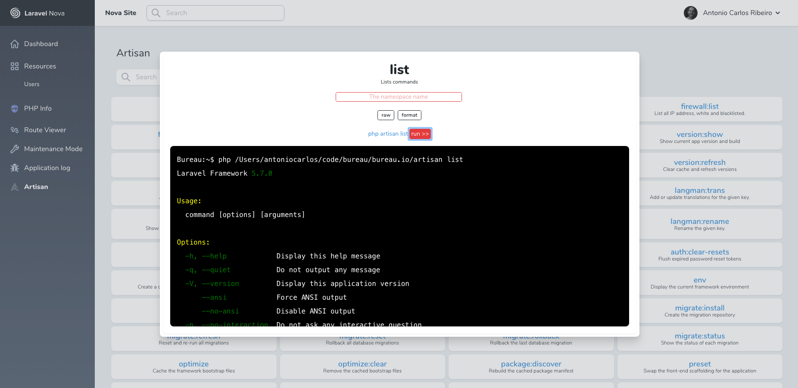
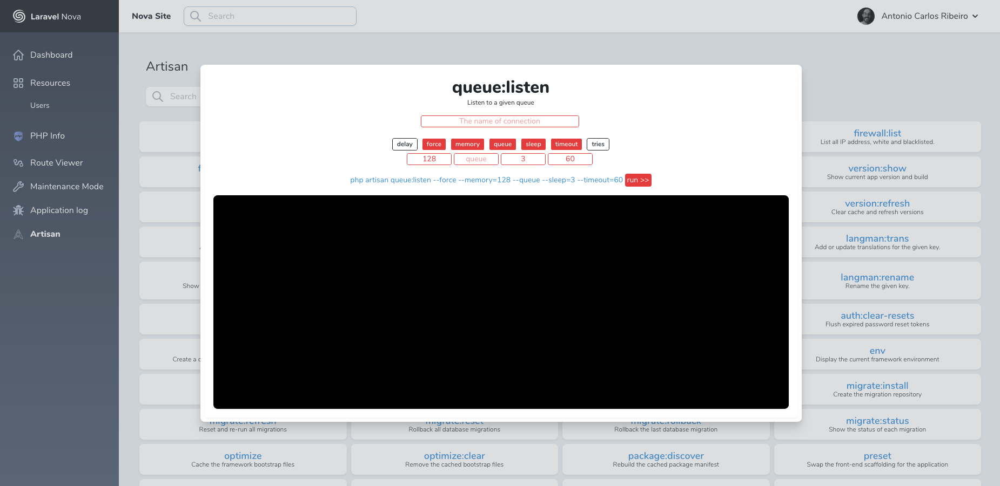

# Artisan Tool
## The power of Artisan in Nova

[](https://packagist.org/packages/pragmarx/artisan-tool)

### Screenshots







### Installation

You can install the package in to a Laravel app that uses [Nova](https://nova.laravel.com) via composer:

```bash
composer require pragmarx/artisan-tool
```

Next up, you must register the tool with Nova. This is typically done in the `tools` method of the `NovaServiceProvider`.

```php
// in app/Providers/NovaServiceProvider.php

// ...

public function tools()
{
    return [
        // ...
        new \PragmaRX\ArtisanTool\Tool,
    ];
}
```

### Whitelist Commands

Optionally, You can use the `whitelistedCommands` to only display a selected list of commands in the nova tool. It is often not a great idea to have every available command in production, e.g. migrate:reset. 

Start by publishing the config file:

```bash
php artisan vendor:publish --provider="PragmaRX\ArtisanTool\ToolServiceProvider" --tag="config"
```

Next, add your commands to the `config/artisan-tool.php` file:

```php
<?php

return [
    'whitelistedCommands' => [
        \Illuminate\Cache\Console\ClearCommand::class,
        \Illuminate\Foundation\Console\ViewClearCommand::class,
        \Illuminate\Foundation\Console\RouteClearCommand::class,
    ],
];
```

### Usage

Click on the "artisan-tool" menu item in your Nova app to see the tool provided by this package.

### Changelog

Please see [CHANGELOG](CHANGELOG.md) for more information on what has changed recently.

### Contributing

Please see [CONTRIBUTING](CONTRIBUTING.md) for details.

### Security

If you discover any security related issues, please email acr@antoniocarlosribeiro.com instead of using the issue tracker.

### Credits

- [Antonio Carlos Ribeiro](https://github.com/antonioribeiro)

### License

The MIT License (MIT). Please see [License File](LICENSE.md) for more information.
